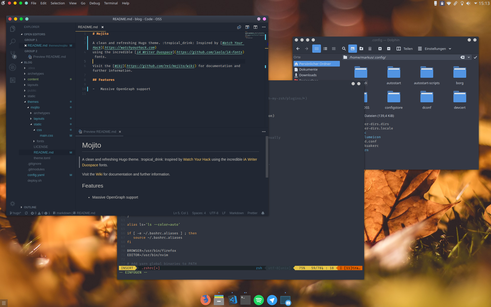

Thank you for visting my dot-files!

As you can see below I am working on [Arch Linux](http://archlinux.org/) with [KDE](https://www.kde.org/) as my window manager and desktop environment. Have a short list of the most important components:

- **Terminal**: [Konsole](https://konsole.kde.org/) [1]
- **Shell**: [Zsh](https://www.zsh.org/) with [Oh My ZSH](https://ohmyz.sh/) using the [Spaceship](https://github.com/denysdovhan/spaceship-prompt) prompt
- **Editor**: [Neovim](https://www.vim.org/) with [Airline](https://github.com/vim-airline/vim-airline) using the [Ayu](https://github.com/ayu-theme/ayu-vim) color scheme
- **Theme**: [Arc Dark](https://github.com/NicoHood/arc-theme)
- **Fonts**: [Noto](https://www.google.com/get/noto/) and [Fira](https://mozilla.github.io/Fira/)
- **Icons**: [Papirus](https://github.com/PapirusDevelopmentTeam/papirus-icon-theme) or on light
  themes [Paper](https://github.com/snwh/paper-icon-theme)

My current set-up looks something like this:



I would love to get some feedback so please do not be shy to leave a comment or even a pull request!

## Usage

Files are managed using [GNU Stow](https://www.gnu.org/software/stow/) (`pacman -S stow`).

```sh
git clone https://github.com/re1/dots
stow -d dots -t ~
```

## Branches

Each branch contains configuration for different window managers and or working environments. <br />
[`master`](https://github.com/re1/dotfiles) contains all common files without any relation to a specific branch (avoids deprecation). For now I am using [`KDE`](https://github.com/re1/dotfiles/tree/kde) but other branches should work fine too!

## Contribution

If you like my dotfiles (and also if you hate them) you can create a pull request for specific files.

---

- [1]: Integrates well with the KDE desktop environment and offers daemonization.
  For other DEs I use [RXVT-unicode](http://software.schmorp.de/pkg/rxvt-unicode.html).
